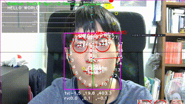

# Vision
A eye gaze tracking library based on computer vision and neural network for NeuralAction. 

This repository is part of project NeuralAction.

Current gaze tracking model's mean error is 3.2 cm in 50 cm far without any calibration. 

With calibration, mean error is ~1.8 cm.

## Demo

- Gaze tracking with calibrations

## TODO

### NeuralAction 0.2 (2019/10~)
- Research
  - More accurate eye-gaze tracker
  - More accurate eye-blink classification
  - Being more robust to a person's appearance difference
- Develop
  - Support ARM64 (WoA)
  - Support WinML / ONNX models
  - Optimize for low-powered devices (low battery, slow CPU or GPU)
  - Windows eye-tracking accessibility API integration

#### Eye-gaze Model
- [x] Channel merged input
- [ ] Neural-net based calibrator
- [ ] MobileNet-v3 training
- [ ] Support IR camera from Windows Hello

#### ARM64(WoA) Support
- [ ] OpenCvSharp native recompile
- [ ] SharpFace native recompile

#### WinML Features
- [ ] WinML backend
- [ ] ONNX model runner
- [ ] ONNX formatted gaze model
- [ ] FP16 computation

#### Data-augmentation
- [x] Grayscale (for IR camera)
- [ ] StyleAug
- [ ] CycleGAN for race appearance transfer

#### Eye-blink Modle
- [ ] Apply transfer-learning

#### Windows Eye-tracking Accessibility API
- [ ] Intergration

### NeuralAction 0.1 (~2018/05)
- Gaze tracking calibration codes
- Put more various data into gaze tracking model.

#### Main Features
- [x] Single camera gaze tracking.
- [x] Gaze tracking service.
- [x] Abstractions around **OpenCV**
- [x] Abstractions around **Tensorflow**
- [x] Platform abstraction layer (Files, Audio, Video, etc...)

#### OpenCV Features
- [x] Face tracking ([Tadas/OpenFace](https://github.com/TadasBaltrusaitis/OpenFace))
- [x] Cascade object detection
- [x] Some examples of openCV
- [x] Cross platform webcam I/O

#### Tensorflow Features
- [x] Data sharing between OpenCV
- [x] Input image normalization
- [x] GPU acceleration supports
- [x] Model imports

